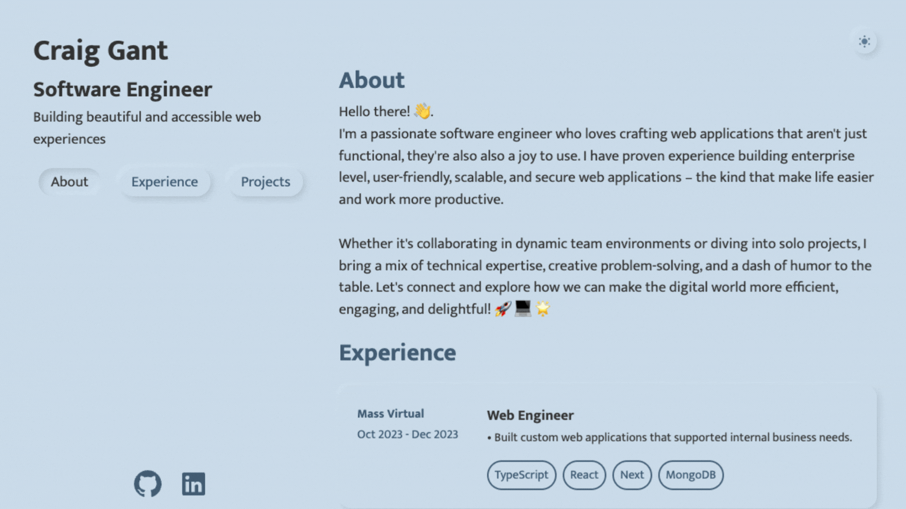

# My Portfolio

This application was built to showcase my experience and capabilities.

I thought it would be fun to build out a portfolio with a semi-neumorphic design and that has a toggle for dark/light mode. I had a really fun time figuring out a custom theming approach that uses custom css variables along with React's context API.
